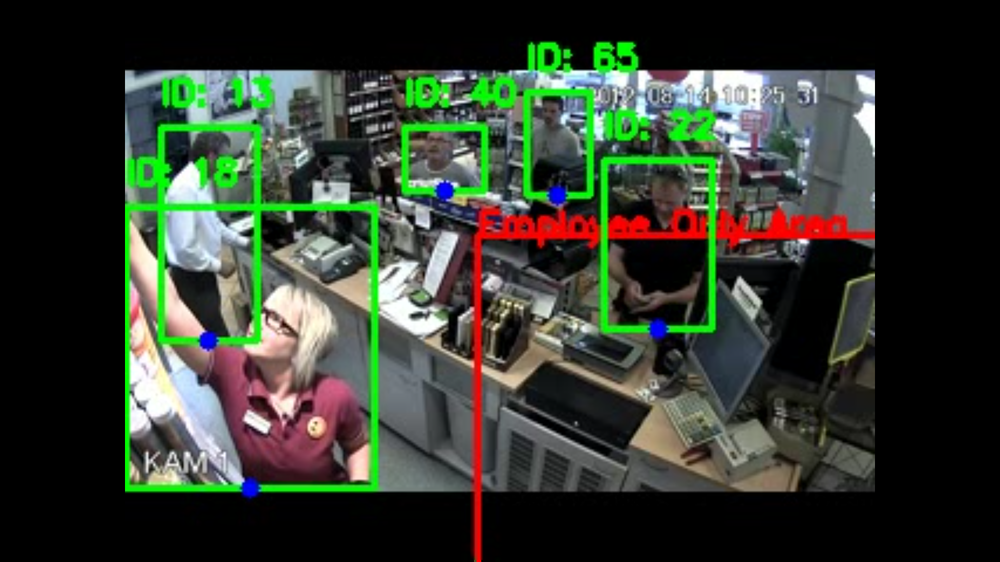

# Video Surveillance Pipeline

## 🏗️ Architecture Overview

This system is designed with a modular, decoupled architecture separating detection, spatial logic, and data logging. 

Pipeline Flow:
1. Input Ingestion: Video frames are read sequentially via OpenCV.
2. Detection & Tracking Engine: Frames are passed to the inference model to extract bounding boxes and track IDs.
3. Spatial & Temporal Logic: Bounding box centroids (feet) are mapped against predefined polygon coordinates. Temporal states are updated per unique ID to track duration inside zones.
4. Output Generation: Events are serialized to a structured JSON file, and annotated frames are compiled into an `.mp4` output.

```Text
[Video Source] ➔ [YOLOv8 + ByteTrack] ➔ [Point-in-Polygon Engine] ➔ [State Manager] ➔ [JSON Log & Annotated .mp4]
```


## 🧠 Model Choices

Detection: YOLOv8
Selected: YOLOv8 Nano (yolov8n.pt) for standard CCTV and YOLOv8 Medium (yolov8m.pt) for aerial/drone footage. Filtered strictly to classes=[0] (person).

Why: YOLOv8 provides a state-of-the-art balance between inference speed and accuracy, allowing this pipeline to run locally on a CPU without requiring cloud GPU resources.

Alternatives Considered: Faster R-CNN was considered for its high accuracy, but it is far too computationally heavy for near real-time CPU processing.

Tracking: ByteTrack
Selected: YOLO's native ByteTrack integration (persist=True).

Why: ByteTrack excels at maintaining tracking IDs during occlusion (e.g., a person walking behind a store shelf) by utilizing low-confidence detection boxes, whereas other trackers might drop the ID entirely.

Alternatives Considered: SORT and DeepSORT. SORT struggles with heavy occlusion, and DeepSORT requires a separate feature-extraction model which adds overhead.


## ⚙️ Setup Instructions

1. Clone the repository and navigate to the directory:

```Bash
git clone <your-repo-link>
cd video-surveillance-assignment
```

2. Create and activate a virtual environment:


Windows:
```Bash
PowerShell
python -m venv venv
.\venv\Scripts\activate
```

Mac/Linux:

```Bash
python3 -m venv venv
source venv/bin/activate
```
3. Install dependencies:

```Bash
pip install -r requirements.txt
```

4. Run the Pipeline:
Use the Command Line Interface (CLI) to pass the video, the specific configuration file, and the desired output paths.

```Bash
python main.py --input data/input/UCF_clip.mp4 --config config_ucf_aisle.json --output_vid data/output/annotated_ucf.mp4 --output_log data/output/events_ucf.json
```


## 🎛️ Configuration

The pipeline is camera-agnostic. To adapt the system to a new camera angle, you do not need to alter the Python code; you simply create a new JSON configuration file.

Example config.json:

```JSON
{
  "zones": [
    {
      "name": "Restricted_Area",
      "coordinates": [[150, 100], [500, 100], [500, 250], [150, 250]],
      "loitering_threshold_seconds": 3.0
    }
  ],
  "target_fps": 30,
  "confidence_threshold": 0.5
}
```

Defining Zones: Map the [X, Y] pixel coordinates of the polygon relative to the camera's resolution.

Adjusting Thresholds: Modify loitering_threshold_seconds to dictate how long a tracked ID must remain in a zone before triggering a loitering event. Lower the confidence_threshold for distant cameras (like drones).


## 📸 Sample Results




## ⚠️ Known Limitations & Future Improvements

Camera Movement (PTZ/Drones): The current spatial logic relies on static pixel coordinates. If the camera pans or a drone moves significantly, the polygon zone will detach from the physical ground. Improvement: Implement image stabilization or homography transformations to anchor zones to real-world GPS/physical coordinates.

Microscopic Object Detection: Small subjects in high-altitude drone footage require increasing the inference resolution (imgsz=1280) and lowering the confidence threshold, which vastly increases computational load. Improvement: Implement SAHI (Slicing Aided Hyper Inference) to process high-res imagery in smaller blocks.

Heavy Occlusion: In highly crowded scenes, ID switching can still occasionally occur if multiple people cross paths simultaneously.

